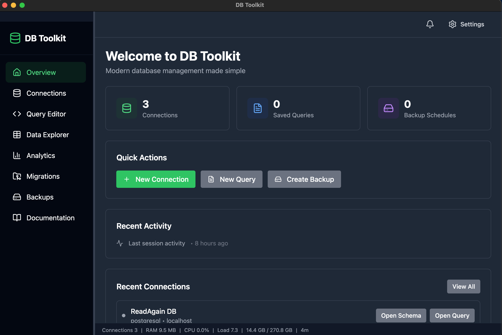

# DB Toolkit

<div align="center">

   

Free, open-source and modern cross-platform database management application with database exploration, query execution, data exploration and management, automated backups and lot more.



</div>

## Features

- **Workspaces** - Multiple isolated workspace tabs (up to 20) for working with different databases simultaneously, with custom names, colors and keyboard shortcuts
- **Multi-Database Support** - PostgreSQL, MySQL, MariaDB, SQLite, MongoDB with connection management and session persistence
- **Connection Groups** - Organize database connections into custom groups for better management and navigation
- **Schema Explorer** - Visual tree browser with table details, search, and real-time updates
- **Query Editor** - Monaco-based editor with syntax highlighting, auto-complete, multiple tabs, history, and AI-powered analysis
- **Data Explorer** - Inline editing, insert/delete rows, pagination, sorting, filtering, CSV/JSON export/import, and cell preview
- **Backup & Restore** - Automated and manual backups with scheduling, compression, verification, and real-time progress
- **AI Query Assistant** - Generate, optimize, and explain SQL queries with Cloudflare AI
- **Settings & Customization** - Dark mode, query defaults, editor preferences, workspace settings, and appearance settings

## Tech Stack

**Backend:** Node.js, Electron IPC, SQLite3, PostgreSQL, MySQL, MongoDB drivers  
**Frontend:** Electron, React 18, Tailwind CSS, Monaco Editor, Framer Motion, Vite

## Running Locally

### Prerequisites

- [Node.js](https://nodejs.org/) 22+
- [Bun](https://bun.sh/) (package manager)

### Setup

```bash
# Clone the repository
git clone https://github.com/db-toolkit/db-toolkit.git
cd db-toolkit/src/db-toolkit

# Install dependencies
bun install

# Start the app in development mode
bun run electron-dev
```

### Building

```bash
# Build for macOS
bun run package:mac

# Build for Windows
bun run package:win

# Build for Linux
bun run package:linux
```

### Environment Variables

Create a `.env` file in `src/db-toolkit/`:

```env
CLOUDFLARE_ACCOUNT_ID=your_account_id
CLOUDFLARE_API_TOKEN=your_api_token
```

> AI Query Assistant features require Cloudflare AI credentials. The app works without them.

## License

MIT License
